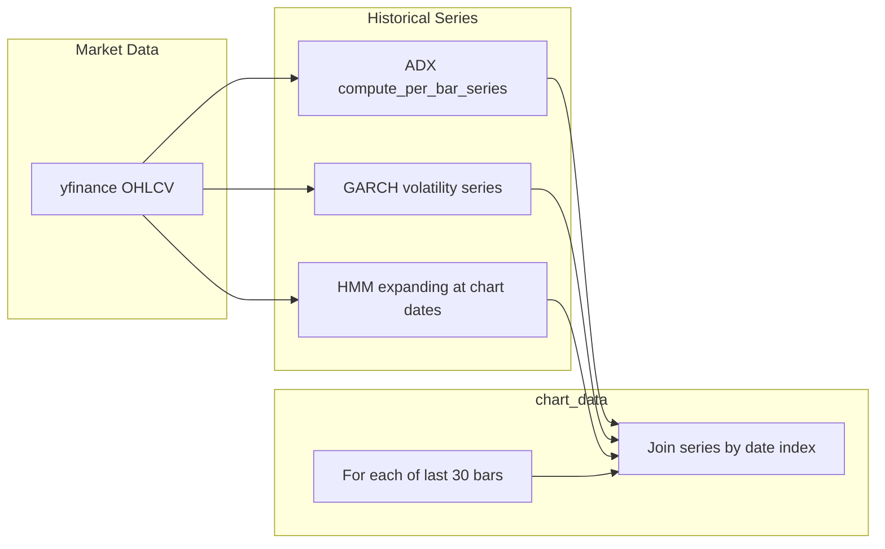

# Statistical Integrity Fix Report — Phase 2

**Date:** 2026-05-25  
**Scope:** Repair statistically invalid `chart_data` and historical engine pipelines identified in `dashboard_validation_report.md`.  
**Files changed:** `backend/main.py`, `backend/engines/hmm_regime_engine.py`, `backend/engines/garch_engine.py`, `backend/engines/adx_engine.py`

---

## What Was Invalid

### 1. Latest-value broadcasting in `chart_data` (critical)

`main.py` loop over `df.tail(30)` attached the **same** latest outputs to every bar:

| Field | Invalid behavior |
|-------|------------------|
| `adx`, `direction`, `trend_strength` | Single `adx_result` from `compute_latest()` |
| `hmm_regime`, `trend_probability`, `crisis_probability` | Single `hmm_data["regime_label"]` and posteriors |
| `garch_vol`, `vol_regime` | Single `garch_data` snapshot |

**Impact:** Chart overlays, transition pulses, and regime markers could not reflect true historical evolution. Transition detection on `hmm_regime` / `direction` was **inert** (constant series).

### 2. HMM full-sample leakage (critical)

`HMMRegimeEngine.classify_regimes()` previously:

- Fit one Gaussian HMM on **entire** history
- Mapped states to labels using **full-sample** volatility means (including future bars)
- Used `predict_proba` in-sample for all times

**Impact:** Regime labels and posteriors were not causal for historical display; state semantics could change retroactively.

### 3. GARCH displayed as constant on chart

Latest conditional σ was repeated; the underlying GARCH recursion **did** produce a proper σₜ series in `arch`, but it was never exposed per bar.

### 4. Missing per-bar fields

`plus_di`, `minus_di`, `mean_revert_probability` were not emitted on `chart_data` despite overlay/panel needs.

---

## What Was Fixed

### ADX (`adx_engine.py`)

- Added `compute_per_bar_series()` (alias path from `compute_series()`).
- Returns one row per input bar: `adx`, `plus_di`, `minus_di`, `direction`, `trend_strength`, `regime`, etc.
- **Causal:** Wilder smoothing at bar *t* uses only OHLCV from series start through *t* (standard ADX construction).

### GARCH (`garch_engine.py`)

- Added `calculate_garch_volatility_series(close)` → DataFrame aligned to price index:
  - `garch_vol` — GARCH(1,1) conditional volatility from `arch` (sequential σₜ)
  - `vol_slope` — `σₜ − σₜ₋₅`
  - `vol_regime` — `EXPANDING_VOL` / `CONTRACTING_VOL` from slope sign at *t*
- `calculate_garch_volatility()` now reads the **last row** of that series (no second model fit in `main.py`).

### HMM (`hmm_regime_engine.py`)

- Replaced full-sample labeling with **expanding-window inference** via `_infer_at_position(features, t)`:
  - Training window: features `[0 .. t]` only
  - Fresh `StandardScaler` + `GaussianHMM` fit per inference point
  - State → {MEAN_REVERT, TRENDING, CRISIS} mapping uses **only** bars assigned to each state within `[0 .. t]`
  - Posteriors are filter probabilities at *t* given data through *t*
- `compute_historical_regimes(df, index=...)` — infer selected dates (used for chart tail).
- `classify_regimes(df)` — **one** expanding fit at the final bar (API snapshot, causal for latest).

### `main.py` chart assembly

For each bar in `df.tail(30)`:

```text
adx_row    ← adx_history.loc[date]
garch_row  ← garch_history.loc[date]
hmm_row    ← hmm_chart.loc[date]   # expanding inference at that date only
```

Fields omitted when NaN / insufficient HMM warmup (no synthetic fill).

---

## How Future Leakage Was Prevented

| Engine | Leakage control |
|--------|-----------------|
| **ADX** | Causal smoothing; per-bar vectorized Wilder recursion |
| **GARCH σₜ** | σₜ from GARCH recursion uses returns ≤ *t* only (given fixed fitted parameters) |
| **HMM** | At date *t*, fit/predict on `features[:t+1]` only; state labels from past assignments in that window only |
| **chart_data** | No broadcast of terminal values; row lookup by date index |

**Explicit non-claim:** HMM posteriors are **filter probabilities**, not calibrated forecast probabilities. They are **not** fake constants, but they still require calibration for risk use (unchanged from audit).

---

## How Per-Bar Computation Works



1. Build full `df` (2y BTC-USD).
2. Compute **full-length** ADX and GARCH series (fast, causal per bar).
3. Compute HMM expanding inference for **30 chart dates** (~30 fits).
4. Append one dict per bar with series values at that date.

**Verification (2y sample, last 30 bars):**

- Unique `adx` values: **30 / 30**
- Unique `garch_vol` values: **30 / 30**
- HMM regimes: **time-varying** (not a single repeated label)

---

## Remaining Weaknesses

1. **GARCH parameter estimation** — σₜ series is causal given parameters, but GARCH(1,1) parameters are estimated once via MLE on the full return sample. Strict walk-forward parameter refitting is **not** implemented.

2. **HMM filter posteriors** — Mathematically correct as in-sample filter probabilities; **not calibrated** for out-of-sample event frequency (`NEEDS_CALIBRATION` remains).

3. **HMM latency** — Expanding refit per chart bar (~30× per `/market` request) adds ~10–15s CPU; full-history expanding (all bars) is available via `compute_historical_regimes(df)` but intentionally **not** called on every API request.

4. **HMM numerical stability** — Occasional `hmmlearn` convergence warnings on short windows; handled by library defaults, not custom fallbacks.

5. **Feature warmup** — `build_hmm_features` drops initial NaN rows; early calendar dates have no HMM fields until `min_train=60` feature bars exist.

6. **Panels not in scope** — RiskPanel placeholders, MarketFeed mock copy, RegimeTimeline cosmetic strip, `bull_probability` heuristic, `market_state` threshold bugs were **not** modified in Phase 2 (chart integrity only).

7. **Correlation engine** — Unaffected; still uses full-sample windows for matrix (separate from `chart_data`).

---

## API / Backtest Compatibility

- `classify_regimes()` still returns the same dict shape; latest values now match a **single** causal expanding fit at the terminal bar.
- `research/backtest_engine.py` continues to call `classify_regimes()` without change.
- `GET /correlation` unchanged.

---

## Summary

| Item | Before | After |
|------|--------|-------|
| `chart_data` ADX/DI | Latest broadcast | Per-bar `compute_per_bar_series` |
| `chart_data` GARCH | Latest broadcast | Per-bar conditional σₜ series |
| `chart_data` HMM | Latest broadcast | Expanding-window per chart date |
| HMM state labels | Full-sample vol sort | Causal window vol sort |
| Future leakage in chart history | Yes | Prevented for displayed bars |

*Phase 2: statistical integrity repair for historical chart intelligence. No UI changes.*
